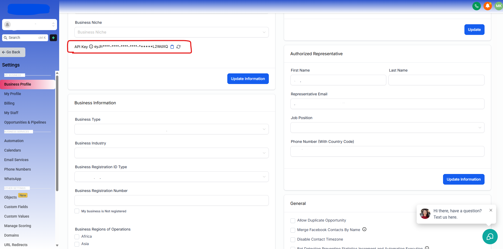

# Go High Level Node JS


 
<br/>

<br/>


Go Highlevel Node Js ease of use library implementation to their API. Make sure you've create a Go Highlevel App in the <a href="https://marketplace.gohighlevel.com/" target="_blank">Market Place</a>


## Brief Overview of the Library GHL APP
We recommend that you glance over the official <a href="https://highlevel.stoplight.io/docs/integrations/0443d7d1a4bd0-overview" target="_blank">Go Highlevel Documentation</a>. We have tried to make the library have a corresponding function for each endpoint. Enjoy the intellisense!

## Brief Overview of the Library GHL using API Key
We recommend that you glance over the official <a href="https://public-api.gohighlevel.com/#intro" target="_blank">Go Highlevel Documentation</a>. We have tried to make the library have a corresponding function for each endpoint. Enjoy the intellisense!



## Initialization
```javascript
import { Gohighlevel } from 'gohighlevel'; // const { Gohighlevel } = require('gohighlevel');

// Create Instance of Gohighlevel

// if you want to use the OAuth Way
const GHL = new Gohighlevel({
    // App Info from GHL Market Place
    clientId: process.env.CLIENT_ID,
    clientSecret: process.env.CLIENT_ID_SECRET,
    redirectUri: process.env.REDIRECT_URI,
    
    isWhiteLabel: true,
    scopes: ["contacts.readonly", "contacts.write", "locations.readonly"]
})

// Or if you just want to an API Key
// How to get API Key - https://www.youtube.com/watch?v=Blr6jTYP3nM&t=3s&pp=ygUeaG93IHRvIGdldCBnb2hpZ2hsZXZlbCBhcGkga2V5
const GHL = new Gohighlevel({ apiKey: process.env.GOHIGHLEVEL_API_KEY })
```


### OAuth URL for GHL App
```javascript
// use the scopes when initializing -> new Gohighlevel({ ... })
let url = GHL.oauth.getOAuthURL()
    
// or if you want to add scopes this way
url = GHL.oauth
    // you can add the necessary scopes for your 
    // using the Builder Design Pattern
    .scopeBusinessesReadonly()
    .scopeBusinessesWrite()
    .scopeCalendarsReadonly()
    .scopeCalendarsEventsWrite()

    // get the oauth URL
    .getOAuthURL()

```


### OAuth Callback for GHL App 
```javascript
async function callback(req, res){
   // Get Auth Info
   const code = req.query.code;
   const refresh_token = req.query.refresh_token;
   const authInfo = await GHL.oauth.getCallbackAuthTokens({
        code: code,
        refresh_token: refresh_token
    });

   // log token values 
   console.log(authInfo.access_token, authInfo.refresh_token, authInfo.expires_in)
   
   // Set Auth Info
   GHL.setAuth(authInfo);
}
```


### Use the API i.e Getting Contacts
```javascript
// Use GHL API
// Corresponse with the endpoint
// For GHL APP - https://highlevel.stoplight.io/docs/integrations/ab55933a57f6f-get-contacts
// For GHL API KEY - https://public-api.gohighlevel.com/#0097b747-33c2-452f-8c78-aab5ab36c071
const contacts = GHL.contacts.search("Martin")
console.log(contacts);
```


## Available Features and Examples

### Contact Management
```javascript
// Search Contacts
// Docs: https://highlevel.stoplight.io/docs/integrations/ab55933a57f6f-get-contacts
const contacts = await GHL.contacts.search("Martin");

// Add Contact
// Docs: https://highlevel.stoplight.io/docs/integrations/a06c8532146af-create-contact
const newContact = await GHL.contacts.create({
    email: "test@example.com",
    firstName: "John",
    lastName: "Doe"
});

// Contact Tasks
// Docs: https://highlevel.stoplight.io/docs/integrations/d839f4b0844d7-get-contact-tasks
const tasks = await GHL.contacts.tasks.get(contactId);

// Contact Notes
// Docs: https://highlevel.stoplight.io/docs/integrations/d0d7d4e495aeb-get-contact-notes
const notes = await GHL.contacts.notes.get(contactId);
```

### Calendar and Appointments
```javascript
// Get Calendar Events
// Docs: https://highlevel.stoplight.io/docs/integrations/7bfd74c6d24ac-get-calendar-events
const events = await GHL.calendar.events.get();

// Create Calendar Event
// Docs: https://highlevel.stoplight.io/docs/integrations/dd1a58077c131-create-calendar-event
const event = await GHL.calendar.events.create({
    title: "Meeting",
    startTime: "2024-03-20T10:00:00Z",
    endTime: "2024-03-20T11:00:00Z"
});

// Get Calendar Resources
// Docs: https://highlevel.stoplight.io/docs/integrations/0e4b5a8d8e5d4-get-calendar-resources
const resources = await GHL.calendar.resources.get();
```

### Conversations and Messaging
```javascript
// Get Conversations
// Docs: https://highlevel.stoplight.io/docs/integrations/b3A6MjU2NzI2Nzc-get-conversations
const conversations = await GHL.conversations.get();

// Send Message
// Docs: https://highlevel.stoplight.io/docs/integrations/b3A6MjU2NzI2ODM-send-message
const message = await GHL.conversations.messages.send({
    type: "text",
    contactId: "contact_id",
    message: "Hello!"
});
```

### Products and Pricing
```javascript
// Get Products
// Docs: https://highlevel.stoplight.io/docs/integrations/c2d2b7f816633-get-products
const products = await GHL.products.get();

// Create Product
// Docs: https://highlevel.stoplight.io/docs/integrations/cdf1c0c5c8116-create-product
const product = await GHL.products.create({
    name: "Product Name",
    price: 99.99
});
```

### Custom Fields and Menus
```javascript
// Get Custom Fields
// Docs: https://highlevel.stoplight.io/docs/integrations/7c20614981ad5-get-custom-fields
const fields = await GHL.customFields.get();

// Create Custom Menu
// Docs: https://highlevel.stoplight.io/docs/integrations/b5c2648a89c23-create-custom-menu
const menu = await GHL.customMenus.create({
    name: "My Menu",
    link: "https://example.com"
});
```

### Opportunities and Pipeline
```javascript
// Get Opportunities
// Docs: https://highlevel.stoplight.io/docs/integrations/b3A6MjU2NzI3MjU-get-opportunities
const opportunities = await GHL.opportunities.get();

// Create Pipeline
// Docs: https://highlevel.stoplight.io/docs/integrations/b3A6MjU2NzI3Mjg-create-pipeline
const pipeline = await GHL.opportunities.pipelines.create({
    name: "Sales Pipeline"
});
```

### SaaS and Snapshots
```javascript
// Get Locations
// Docs: https://highlevel.stoplight.io/docs/integrations/b3A6MjU2NzI3NDQ-get-locations
const locations = await GHL.saas.getLocations();

// Create Snapshot
// Docs: https://highlevel.stoplight.io/docs/integrations/b3A6MjU2NzI3NDc-create-snapshot
const snapshot = await GHL.snapshots.create({
    name: "Backup 2024"
});
```

### Email Verification
```javascript
// Verify Email
// Docs: https://highlevel.stoplight.io/docs/integrations/47a095a7cf1af-email-verification
const verification = await GHL.email.verify({
    email: "test@example.com"
});
```

### Business and Company Management
```javascript
// Get Business Details
// Docs: https://highlevel.stoplight.io/docs/integrations/b3A6MjU2NzI2NTU-get-business
const business = await GHL.businesses.get();

// Update Company
// Docs: https://highlevel.stoplight.io/docs/integrations/b3A6MjU2NzI2NTg-update-company
const company = await GHL.company.update({
    name: "New Company Name"
});
```

## Support
You can support us with any amount. It's all appreciated.

<a href="https://www.buymeacoffee.com/m2kdevelopments" target="_blank">
    
</a>

<a href="https://paypal.me/m2kdevelopment" target="_blank">
    
</a>
